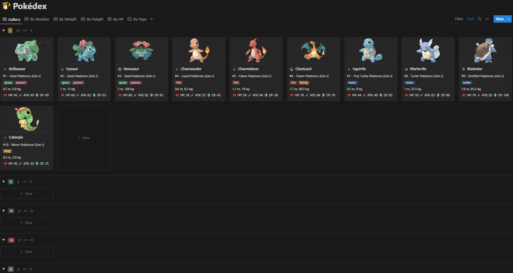

# Pokémon Data Notion Integration

This project is a Node.js script that fetches Pokémon data from the PokeAPI and creates corresponding pages in a Notion database using the Notion API.

## Table of Contents

- [Introduction](#introduction)
- [Installation](#installation)
- [Usage](#usage)
- [Run Locally](#running-locally)

## Introduction

The Pokémon Data Notion Integration is a script that fetches Pokémon data from the PokeAPI and automatically creates pages in a Notion database. It utilizes the PokeAPI to retrieve information such as name, type, stats, and flavor text for each Pokémon. The script then formats the data and uses the Notion API to create pages in a specified Notion database. This integration simplifies the process of populating a Pokémon-themed Notion database with detailed information about each Pokémon.

## Installation

1. Clone the repository:

   ```bash
   git clone https://github.com/your-username/pokemon-data-notion-integration.git
   Install the required dependencies:
   -axios
   -@notionhq/client
   -dotenv
   ```

   `yarn install`

2. Set up the environment variables:
   Create a .env file in the project's root directory.

3. Run the script:
   `node index.js`

## Usage

Before running the script, make sure you have set up the environment variables as mentioned in the installation instructions. The script will fetch Pokémon data from the PokeAPI and create corresponding pages in the specified Notion database.

## Screenshots


